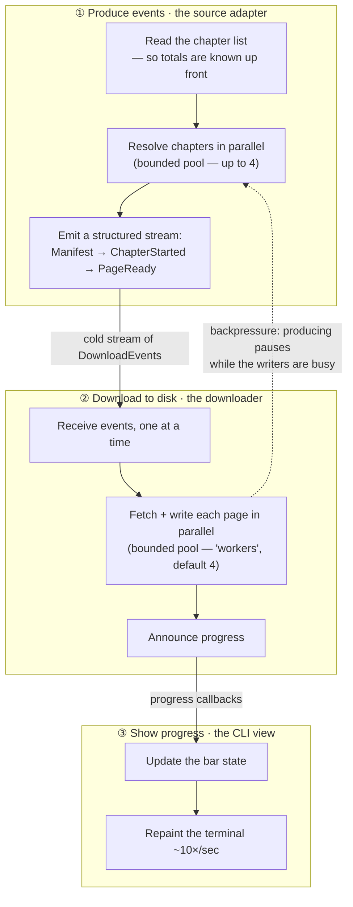
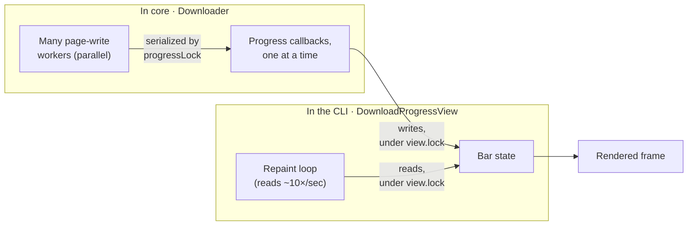

# Design — the download pipeline: events + coroutines

> How the structured download stream ([`DownloadEvent`]) and the coroutines that
> produce and consume it fit together. The *decision* to use an event stream lives
> in [ADR-0010](../adr/0010-structured-download-event-stream.md); this document is
> the *mechanics* — the concurrency model, ordering guarantees, backpressure, and
> failure/cancellation behaviour. Read [ARCHITECTURE.md §4.4](../../ARCHITECTURE.md)
> first for the two-layer summary.

## The players



**Where each stage lives:** ① `MangaDexCatalog.download` (`pixerion-core/.../mangadex`),
② `Downloader.download` (`pixerion-core/.../download`), ③ `DownloadProgressView`
(`pixerion-cli/.../output`). ① and ② run in **two independent coroutine scopes** —
the adapter's `channelFlow` and the downloader's `coroutineScope` — that share no
coroutines and talk *only* through the cold `Flow<DownloadEvent>`. The dashed
back-edge is not another channel: it is what *not draining* the stream does — the
write pool going busy quietly stalls the whole chain back to the source (see
[Consumer side](#consumer-side--downloaderdownload)).

## The event stream and its ordering guarantees

`Catalog.download` returns `Flow<DownloadEvent>` (see
[`DownloadEvent.kt`](../../pixerion-core/src/main/kotlin/io/modernia/pixerion/domain/DownloadEvent.kt)):

```
Manifest(chapters)                       // exactly once, first
ChapterStarted(chapterId, label, pages)  // once per chapter, before its pages
PageReady(chapterId, page)               // once per page
```

Two guarantees hold, and one deliberately does **not**:

- **`Manifest` is strictly first.** The adapter `send`s it *before* the `for` loop
  launches any chapter coroutine, so nothing races ahead of it.
- **Within a chapter, `ChapterStarted` precedes that chapter's `PageReady`s.** They
  are sent sequentially from the *same* chapter coroutine, and a channel preserves
  the order of sends from a single producer coroutine.
- **Across chapters, events interleave — by design.** Chapter coroutines run
  concurrently (up to `DOWNLOAD_WORKER` at once), so `PageReady(chapterId=A, …)` and
  `PageReady(chapterId=B, …)` arrive intermixed. This is exactly the "several
  chapters downloading at once" the progress UI visualizes. **Consumers must key
  per-chapter state by `chapterId`** rather than assuming pages arrive
  chapter-by-chapter. (`chapterId`, not the display `label`, because two chapters
  can share a label.)

Because the flow is **cold**, none of this happens until someone collects it;
`Downloader` is the collector.

## Producer side — `MangaDexCatalog.download`

[`MangaDexCatalog.kt`](../../pixerion-core/src/main/kotlin/io/modernia/pixerion/mangadex/MangaDexCatalog.kt):

```kotlin
channelFlow {
    val mangaId = ref.toMangaId() ?: return@channelFlow   // unresolvable → empty flow
    val chapters = client.chapters(mangaId, LANGUAGE)      // suspend: serial feed pagination
    send(DownloadEvent.Manifest(chapters.size))            // totals are known here…
    val gate = Semaphore(DOWNLOAD_WORKER)                  // …so the manifest is determinate
    for (chapter in chapters) {
        launch {                                           // one child coroutine per chapter
            gate.withPermit {
                val server = client.atHomeServer(chapter.id)      // suspend: network
                send(DownloadEvent.ChapterStarted(chapter.id, label, server.chapter.data.size))
                server.chapter.data.forEachIndexed { i, filename ->
                    send(DownloadEvent.PageReady(chapter.id, MangaDexPage(…)))
                }
            }
        }
    }
}
```

- **`channelFlow` gives a `ProducerScope`** — both a `CoroutineScope` (so `launch` is
  legal) and a `SendChannel` (so `send` is legal). Plain `flow { }` forbids emitting
  from other coroutines; `channelFlow` exists precisely to fan multiple producers
  into one stream.
- **`Semaphore(DOWNLOAD_WORKER = 4)`** bounds how many chapters resolve their
  at-home server and stream pages *concurrently*. This is the **producer-side**
  concurrency limit.
- **`channelFlow` is a structured-concurrency boundary.** It does not close the
  channel until every `launch`ed child finishes, so the flow completes only after
  all chapters have streamed. A child that throws (e.g. `atHomeServer` returns 503 →
  `CatalogException`) cancels the `channelFlow` scope and closes the channel *with
  that exception* — which then surfaces in the collector (see
  [Failure](#failure-and-cancellation)).
- **Page bytes stay lazy.** `PageReady` carries a `MangaDexPage` whose `bytes()`
  hits the network only when called — the producer sends *descriptors*, not images.

## Consumer side — `Downloader.download`

[`Downloader.kt`](../../pixerion-core/src/main/kotlin/io/modernia/pixerion/download/Downloader.kt):

```kotlin
coroutineScope {
    val gate = Semaphore(workers)                          // consumer-side limit (default 4)
    catalog.download(ref).collect { event ->               // sequential collector
        when (event) {
            is Manifest       -> progress.onStart(event.chapters)
            is ChapterStarted -> { register tally; progress.onChapterStart(…); if 0 pages → complete }
            is PageReady      -> {
                val tally = chapters.getValue(event.chapterId)
                gate.acquire()                             // ① bound writes + backpressure
                launch(dispatcher) {                       // ② write worker on Dispatchers.IO
                    try {
                        Files.write(file, event.page.bytes())   // network fetch + disk write
                        val written = tally.written.incrementAndGet()
                        synchronized(progressLock) {            // ③ serialize callbacks
                            progress.onPageWritten(id, written, tally.total)
                            if (written == tally.total) progress.onChapterComplete(id)
                        }
                    } finally { gate.release() }
                }
            }
        }
    }
}
```

Three interlocking pieces:

1. **The collector is single-threaded logic.** `collect { … }` runs the lambda one
   event at a time in the `coroutineScope`'s coroutine. So `Manifest` and
   `ChapterStarted` handling (registering the per-chapter `ChapterTally`, firing
   `onStart`/`onChapterStart`) needs no synchronization — it can't overlap itself.
   This is also why `chapters.getValue(chapterId)` on a `PageReady` is safe: the
   ordering guarantee means the chapter's `ChapterStarted` was already processed.

2. **`gate.acquire()` *before* `launch` is the backpressure valve.** When `workers`
   writes are already in flight, `acquire()` suspends the collector. A suspended
   collector stops pulling from the channel; `channelFlow`'s channel is buffered
   (default capacity 64), so producers run ahead only until that buffer fills, at
   which point the next `send()` suspends — stalling that chapter coroutine, and
   (once all 4 producer permits are parked on `send`) the producer. The buffer is
   bounded slack, not an escape hatch: **one `acquire()` throttles the whole pipeline
   back toward the source**, so pages are never fetched more than ~64 events ahead of
   the writers. The write itself runs on `Dispatchers.IO` (injectable for tests),
   where blocking `Files.write` belongs.

3. **`coroutineScope` is the wait-group.** It returns only after `collect` finishes
   *and* every `launch`ed write child completes — structured concurrency gives a
   built-in join with no manual bookkeeping. Only then is the `Summary` computed, so
   its page/chapter counts reflect what actually reached disk.

## Progress callbacks — the threading model

Callbacks reach a `DownloadProgress` sink from **two different contexts**:

| Callback | Fired from | Context |
|---|---|---|
| `onStart`, `onChapterStart` | the `collect` lambda | the collector coroutine (one at a time) |
| `onPageWritten`, `onChapterComplete` | inside `launch(Dispatchers.IO)` | any of `workers` write coroutines, concurrently |

So without care a sink could see `onPageWritten` calls overlapping on several IO
threads. `Downloader` prevents that: **every** listener call is wrapped in
`synchronized(progressLock)`, so the sink observes a strictly serial call sequence
and needs no locking of its own. The callbacks are cheap and non-blocking by
contract, so this lock is never contended for long.

The CLI adds a **second, independent lock** one layer out. `DownloadProgressView`
receives those serialized callbacks (writer) but is also read by a separate repaint
coroutine every ~100 ms (reader). Its own `lock` guards the view's state map so the
two don't tear:



Two lock domains, one per box: `progressLock` (in `core`) funnels the parallel
writers into a single, ordered callback stream; `view.lock` (in the CLI) then keeps
those callback *writes* from tearing against the repaint loop's *reads*.

The repaint coroutine is a sibling of the download call inside the command's
`coroutineScope`; it only ever *reads* view state and writes to the terminal — it
never touches the channel or the download's coroutines. On completion the command
`cancelAndJoin`s the painter *before* wiping the live region, so no stale frame is
redrawn after the summary is printed. Off a TTY the painter is a no-op and the view
reports completions as plain lines instead (see
[`DownloadProgressView`](../../pixerion-cli/src/main/kotlin/output/DownloadProgressView.kt)).

## Failure and cancellation

Structured concurrency makes both directions automatic:

- **A source failure during collection.** If a write's `page.bytes()` throws
  `CatalogException`, the exception escapes its `launch` and cancels the
  `Downloader`'s `coroutineScope` — cancelling sibling writes, cancelling the
  `collect`, and propagating out of `download` as that `CatalogException`. A
  *producer* failure (e.g. `atHomeServer` 503) instead cancels the `channelFlow`
  scope and closes the channel exceptionally, which the collector re-throws — same
  net effect. This is the contract's "source-level failures surface as
  `CatalogException` *during collection*".
- **External cancellation** (Ctrl-C, or the CLI cancelling the scope) propagates the
  other way: cancelling the consumer scope cancels the collector, which cancels the
  cold flow's producer coroutines. In-flight writes see `CancellationException` at
  their next suspension point; the `finally { gate.release() }` still runs.

## Why three governors, and what each bounds

Beneath the two coroutine semaphores sits a transport-layer governor, so it's worth
naming all three to avoid conflating them:

| Governor | Where | Bounds |
|---|---|---|
| `Semaphore(DOWNLOAD_WORKER = 4)` | `MangaDexCatalog` (producer) | chapters resolving + streaming concurrently |
| `Semaphore(workers = 4)` | `Downloader` (consumer) | page **writes** in flight (⇒ page **fetches** in flight, via backpressure) |
| `RateLimiter(5/s)` + `maxRequestsPerHost` | `MangaDexClient` (OkHttp interceptors) | **all** HTTP traffic, smoothed under MangaDex's per-IP cap |

The coroutine semaphores shape *structure and memory* (how much is in flight); the
rate limiter shapes *transport politeness* (requests per second). They compose: even
with 4 concurrent writers each calling `bytes()`, the OkHttp limiter paces the actual
image requests to 5/s. See [ARCHITECTURE.md §4.3–4.4](../../ARCHITECTURE.md) for the
transport detail.
